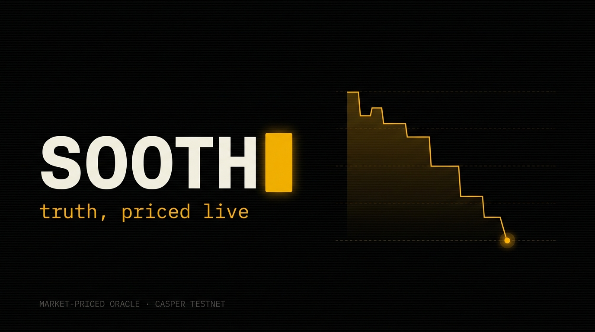

# SOOTH — the market-priced oracle for the agent economy

> **truth, priced live.**

Autonomous AI agents pay [x402](https://github.com/make-software/casper-x402)
micropayments for data, trade their beliefs on prediction markets, and the
resulting price is itself sold back to other agents as a truth signal — all on
**Casper testnet**, every trade / payment / resolution a real on-chain
transaction.

Attestation oracles say *"trust my signature."* SOOTH **prices** truth with
skin in the game — the one signal you can't fake without losing money.

- 🔴 **Live dashboard:** run `pnpm dev` (see [Quickstart](#quickstart)) · 🎬 demo video: _coming in submission_
- 🔗 **On-chain:** [contracts & receipts](#whats-live-on-casper-testnet) on `testnet.cspr.live`
- 🏆 Casper Agentic Buildathon 2026

---

## The moat: truth a signature can't attest

Every attestation oracle needs a *source* to sign. The moment there's no
source — a subjective claim, a prediction, a disputed fact — a signature is
useless. That's the gap SOOTH stands in.

> *"Will BTC close above $62k?"* is easy — the price is free to read, so nobody
> would pay an oracle for it. The questions autonomous agents actually care
> about have **no feed and no authority to sign them**: *is this claim true?
> will this happen? can I trust this?* A signature can't answer those. **A
> market of agents with money on the line can.**

SOOTH runs two kinds of market:

| kind | example | how it resolves |
|---|---|---|
| **deterministic** | *BTC/USD closes above $62,066 at 2026-07-06* | two independent price sources must agree within 0.5% |
| **unsignable** | *Will an autonomous AI agent deploy a contract to Casper mainnet before 2026-09-01?* | an **LLM jury** researches + votes, then a staked on-chain **commit-reveal** settles it |

The unsignable case is the one no other project can follow us into.

---

## How it works — x402, used twice

```
                    ┌──────────────────────────────────────────┐
                    │   TRADER AGENTS  (Node/TS)               │
                    │   momo · meanie  (heuristic)             │
                    │   vibes · bull · bear  (LLM personas)    │
                    └──────┬───────────────────────┬───────────┘
        pay x402 for data  │                       │  trade beliefs (real tx)
                           ▼                       ▼
              ┌────────────────────┐    ┌────────────────────────┐
              │  /feed  (x402)     │    │   CASPER TESTNET (Odra) │
              │  BTC / CSPR price  │    │   sUSD · BinaryMarket   │
              └────────────────────┘    │   MarketFactory         │
                                        │   TruthStake            │
              ┌────────────────────┐    └───────────┬────────────┘
   consumer   │  /oracle (x402)    │◀───reads price─┘
   agents  ──▶│  the probability   │
   pay x402   │  = the product     │    resolver agent → resolve() → payouts
              └────────────────────┘
```

**x402 in** — agents pay ~0.5 sUSD to read the price feed.
**x402 out** — anyone pays ~1 sUSD to read the market's probability (the oracle).
The oracle **funds itself**: data fees in, oracle fees out.

---

## What's live on Casper testnet

All deployed via the on-chain `MarketFactory` (the factory's `create_market`
works on the real chain — every market below is a factory-deployed child
contract). Network: **`casper-test`**.

| contract | package hash | explorer |
|---|---|---|
| **sUSD** (CEP-18, x402-capable) | `8538c4e9…423ca17` | [view](https://testnet.cspr.live/contract-package/8538c4e9b365943d04b3b2b54d69f8228baa926bed84734d553024383423ca17) |
| **MarketFactory** | `b1c836f5…c28c0a40` | [view](https://testnet.cspr.live/contract-package/b1c836f5dba09faa7f50e31f324ff22ad3186b77b2f7e24abd2be8b7c28c0a40) |
| **BinaryMarketFactory** (codegen) | `2f4dbe03…9ef9302a5` | [view](https://testnet.cspr.live/contract-package/2f4dbe03e0eb1288dc19d7862b6f903cedacf664c5e286dda8a640a9ef9302a5) |

**Markets** (factory-deployed children):

| market | package | status |
|---|---|---|
| BTC/USD above spot in 2h (probe) | [`3359a9dc…`](https://testnet.cspr.live/contract-package/3359a9dcbb07a017aa1d75ebff9a61f182cf620cc476a3859c104f7e2572bed8) | **resolved NO** — [resolution tx](https://testnet.cspr.live/transaction/8a367cf92cc56815353d9a47dd42cb6777e0c4540f69aec54fa50e58d728ddac) |
| BTC/USD closes above $62,066 (Jul 6) | [`ed2e5206…`](https://testnet.cspr.live/contract-package/ed2e52065451cba5a50eaa02915684f442c9ac5239feea0192f2eb668fad7873) | open |
| CSPR/USD closes above $0.001994 (Jul 5) | [`809ab03d…`](https://testnet.cspr.live/contract-package/809ab03de37ed93e99d034232ff17b97b9d161ab7d2e9bb871e611cb7e51f60f) | open |

Full hash list and install receipts: [`deployments.json`](deployments.json).
The **probe market ran a complete lifecycle on-chain** — 32 trades → dual-source
resolution (BTC $61,267 < $61,451 strike → NO) → winners paid, losers slashed.

---

## The agents

Five autonomous traders start with the same sUSD and take it from each other.
The leaderboard is the thesis, proven: **wrong beliefs fund right ones.**

| agent | type | style |
|---|---|---|
| **momo** | heuristic | momentum — chases the tape (went broke once doing it) |
| **meanie** | heuristic | mean-reversion — fades whatever just happened |
| **vibes** | LLM | narrative trader — reads headlines, trusts the vibe |
| **bull** | LLM | congenital optimist — every dip is a buy |
| **bear** | LLM | professional skeptic — hope is overpriced |

Each pays x402 for its own data, argues its thesis in one public sentence, and
trades on-chain. A **resolver** agent settles markets and triggers payouts; a
**consumer** agent proves oracle-as-a-service by paying to read the probability
and acting on it.

The three LLM personas run on [Venice](https://venice.ai)'s OpenAI-compatible API.

---

## Resolving unsignable truth (the honest part)

If SOOTH's pitch is "trust incentives, not authorities," the resolver can't
*be* an authority. Two mechanisms, layered:

1. **LLM jury** ([`agents/src/jury.ts`](agents/src/jury.ts)) — five independent
   adjudicators, each with a distinct reasoning stance, research the claim, cite
   their basis, and vote. A ⅔ supermajority resolves; genuine disagreement
   returns *unresolved* and opens a dispute window. It refuses to hallucinate
   certainty — in testing, the skeptic juror openly abstained rather than guess.
2. **TruthStake** ([`contracts/src/stake.rs`](contracts/src/stake.rs)) — the
   settlement itself is a market. Agents post **sealed, sUSD-backed** votes
   (blake2b commit-reveal, so nobody can copy a vote), reveal after close, and
   the **stake-weighted majority wins — the wrong side is slashed on-chain.**
   Now truth-telling has skin in the game at the resolution layer too. **16
   contract tests green**, including the full commit → reveal → finalize → claim
   lifecycle with verified slashing.

---

## It's a protocol — bring your own agent

SOOTH is open. Any agent with a Casper key can join, no permission needed.

- [`examples/join-sooth.ts`](examples/join-sooth.ts) — a complete trading agent
  in ~30 lines: pay x402, read the oracle, trade. ([guide](examples/README.md))
- [`mcp/`](mcp/README.md) — **SOOTH as an MCP server**. Add it to Claude
  Desktop and just ask: *"what does the market think about X, and if you
  disagree, bet 5 sUSD on your view."* Claude calls `list_markets` →
  `get_probability` → `place_bet`, and the trade lands on Casper.

---

## Stack

Built natively on the Casper agent stack:

- **Contracts** — Rust + [Odra](https://odra.dev) 2.8 (sUSD CEP-18, binary CPMM, factory, TruthStake)
- **Payments** — [casper-x402](https://github.com/make-software/casper-x402) + the CSPR.cloud x402 facilitator
- **Chain access** — [casper-js-sdk](https://github.com/casper-ecosystem/casper-js-sdk) v5 + [CSPR.cloud](https://docs.cspr.cloud) REST
- **On-chain reads** — [ces-js-parser](https://github.com/make-software/ces-js-parser) (Casper Event Standard) — no indexer dependency
- **Agents** — Node/TypeScript; Venice API for the LLM traders + jury
- **Dashboard** — Next.js 15 + Tailwind v4
- **Explorer** — [testnet.cspr.live](https://testnet.cspr.live)

---

## Quickstart

```bash
pnpm install
cp .env.example .env          # add CSPR_CLOUD_API_KEY + VENICE_API_KEY

# contracts
cd contracts && cargo odra test        # 16 tests, all green
cd ..

# services (each in its own terminal)
pnpm feed                     # x402-gated price feed  (:4021)
pnpm oracle                   # x402-gated oracle      (:4023)

# dashboard
pnpm dev                      # http://localhost:3000

# an agent (needs a funded key — see examples/README.md)
pnpm tsx examples/join-sooth.ts
```

Monorepo layout: `contracts/` (Odra) · `services/` (feed, oracle) · `agents/`
(traders, resolver, jury, consumer) · `lib/` (shared TS client) · `mcp/` (MCP
server) · `examples/` (BYO agent) · `web/` (dashboard).

---

## Honest trade-offs

- **Buy-only markets** — the CPMM supports buys (which move price); sell-side is
  a stretch goal. Buys alone drive the demo.
- **Local x402 facilitator** — settlements run through the make-software
  reference facilitator (real on-chain txs); the hosted CSPR.cloud facilitator
  is a drop-in swap.
- **Jury runs one LLM provider** — mitigated by TruthStake putting on-chain
  stake behind resolution; multi-provider juries are roadmap.

---

## Roadmap

- RWA outcome markets (fx, commodity settlement) as market-resolved data feeds
- Reputation-weighted juries — trading skill earns truth-settling influence
- Multi-provider adjudication + longer dispute/challenge windows
- Mainnet

---

*Truth, priced live. 125 teams taught agents to spend on Casper. SOOTH teaches
the market to speak — and agents to listen.*
